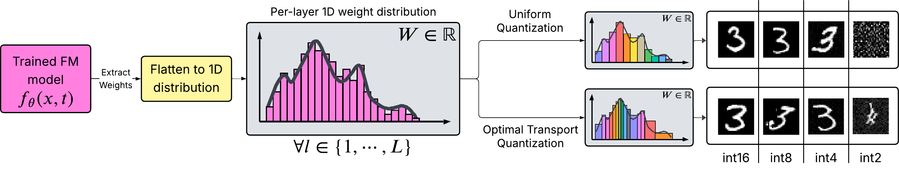

# Optimal Transport-based Quantization in Flow Matching Models

_Dara Varam, Lujain Khalil, and Raghad Aldamani_

This repository contains the implementation of a novel approach for quantizing Flow Matching models using Optimal Transport. The project includes implementations for various datasets (MNIST, Fashion-MNIST, CIFAR-10, and CelebA) and demonstrates the effectiveness of our quantization method.



## Project Structure

```
├── Downstream Tasks/        # Evaluation of downstream task performance
├── Starting New/           # Core implementation files
│   ├── SimpleMNIST.py     # MNIST model implementation
│   ├── SimpleFMNIST.py    # Fashion-MNIST model implementation
│   ├── SimpleCIFAR-10.py  # CIFAR-10 model implementation
│   ├── SimpleCelebA.py    # CelebA model implementation
│   └── Quantizers/        # Quantization implementations
├── requirements.txt       # Project dependencies
└── README.md             
```

## Requirements

The project requires several Python packages. You can install them using:

```bash
pip install -r requirements.txt
```


## Training and Evaluation

The training process consists of several steps:

1. **Base Model Training**: Train flow matching models on different datasets
2. **Quantization**: Apply OT-based quantization to the trained models
3. **Sample Generation**: Generate samples from both full-precision and quantized models
4. **Evaluation**: Assess performance using FID scores and downstream task accuracy

### Running Quantization

The project supports both uniform and optimal transport (OT) based quantization at various bit widths (2, 4, 8, 16 bits). To quantize a model:

1. Ensure your trained model is in the `models` directory with the appropriate name:
   - MNIST: `mnist_model.pt`
   - Fashion-MNIST: `fmnist_model.pt`
   - CIFAR-10: `cifar10_model.pt`
   - CelebA: `celebA_model.pt`

2. Run the quantization script for your dataset:
```bash
python Starting\ New/Quantizers/Quantization-MNIST.py     # For MNIST
python Starting\ New/Quantizers/Quantization-FMNIST.py    # For Fashion-MNIST
python Starting\ New/Quantizers/Quantization-CIFAR-10.py  # For CIFAR-10
python Starting\ New/Quantizers/Quantization-CelebA.py    # For CelebA
```

The quantized models will be saved in `quantized_models/<dataset>/<method>/` where:
- `<dataset>` is one of: mnist, fmnist, cifar10, celebA
- `<method>` is either: uniform or ot

### Sample Generation

To generate samples from quantized models:

```bash
python Starting\ New/Quantizers/Sample-MNIST.py     # For MNIST
python Starting\ New/Quantizers/Sample-FMNIST.py    # For Fashion-MNIST
python Starting\ New/Quantizers/Sample-CIFAR10.py   # For CIFAR-10
python Starting\ New/Quantizers/Sample-CelebA.py    # For CelebA
```

Generated samples will be saved in `sampling/<dataset>/<method>/<bit_width>/`.

### Evaluation

The framework provides two types of evaluation:

1. **Sample Quality Evaluation** (FID scores and Inception Score):
```bash
python Starting\ New/Quantizers/evaluate_samples.py
```
Results will be saved in `samples_evaluation_results.json`

2. **Downstream Task Evaluation** (Classification accuracy):
```bash
python Starting\ New/Quantizers/classify_samples.py
```
Results will be saved in `downstream_results.json`

3. **Visualize Results**:
```bash
python Starting\ New/Quantizers/plot_results.py
```
This will generate plots comparing uniform and OT-based quantization performance, saved in the `plots` directory.


## Citation

If you use this code in your research, please cite our work:

[Citation information will be added upon publication]